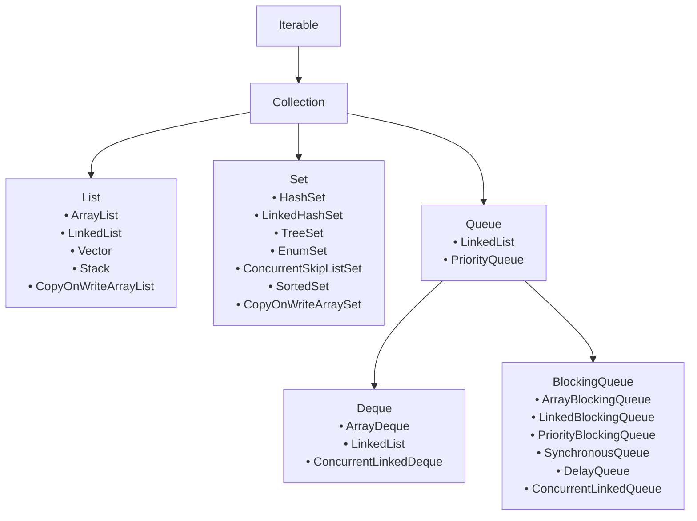

# 📚 Java Collections Framework

---

## 📋 Table of Contents

1. [🔍 What is a Collection?](#-what-is-a-collection)
2. [⏳ Pre-Collections Era](#-pre-collections-era)
3. [❌ Problems with Early Classes](#-problems-with-early-classes)
4. [🚀 Collection Framework Solution](#-collection-framework-solution)
5. [✨ Key Features](#-key-features)
6. [🏗️ Key Interfaces](#️-key-interfaces-in-collection-framework)
7. [📊 Java Collections Framework Hierarchy](#-java-collections-framework-hierarchy)
8. [📖 Additional Resources](#-additional-resources)

---

## 🔍 What is a Collection?

> **Definition**: A **collection** is an object that represents a group of objects, known as its elements.

Collections provide a unified way to store, retrieve, manipulate, and communicate aggregate data. They are fundamental to modern Java programming and form the backbone of data structure operations.

---

## ⏳ Pre-Collections Era

Before the introduction of the Collection Framework in **JDK 1.2**, Java relied on a variety of disparate classes to store and manipulate groups of objects:

| **Class** | **Purpose** | **Limitations** |
|-----------|-------------|-----------------|
| `Vector` | Dynamic arrays | Synchronized (performance overhead) |
| `Stack` | LIFO data structure | Extends Vector, inherits limitations |
| `Hashtable` | Key-value pairs | Synchronized, no null values |
| `Arrays` | Fixed-size collections | Inflexible, primitive operations |

---

## ❌ Problems with Early Classes

The pre-framework approach suffered from several critical issues:

### 1. 🔄 **Inconsistency**
Each class had a different API and way of managing collections, leading to:
- Confusion among developers
- Steep learning curve
- Inconsistent method naming conventions

### 2. 🔌 **Lack of Interoperability**
- Classes were not designed to work together seamlessly
- No common protocols for data exchange
- Difficult to switch between different collection types

### 3. 🎯 **No Common Interface**
- Absence of unified interface hierarchy
- Impossible to write generic algorithms
- Code reusability was severely limited

---

## 🚀 Collection Framework Solution

To address these fundamental problems, Java introduced the **Collection Framework** - a unified architecture for representing and manipulating collections.

---

## ✨ Key Features

The Collection Framework revolutionized Java programming with these core features:

### 1. 🏛️ **Unified Architecture**
A consistent set of interfaces and implementations for all collection types, providing:
- Standardized method signatures
- Predictable behavior across all collections
- Reduced learning curve

### 2. 🔗 **Interoperability**
Collections can be easily interchanged and manipulated in a uniform way:
- Seamless conversion between collection types
- Compatible APIs across implementations
- Pluggable architecture

### 3. ♻️ **Reusability**
Generic algorithms can be written that work with any collection:
- Polymorphic operations
- Algorithm reuse across different data structures
- Separation of algorithms from data structures

### 4. ⚡ **Efficiency**
The framework provides optimized algorithms for fundamental operations:
- Searching and sorting algorithms
- Memory-efficient implementations
- Performance-tuned operations

---

## 🏗️ Key Interfaces in Collection Framework

The Collection Framework is built around a hierarchical set of interfaces:

### 🌟 **Core Interfaces**

| Interface | Icon | Description | Key Implementations |
|-----------|------|-------------|-------------------|
| **Collection** | 📦 | Root interface for all collection types | N/A (Abstract) |
| **List** | 📋 | Ordered collection allowing duplicates | ArrayList, LinkedList, Vector |
| **Set** | 🎯 | Collection with no duplicate elements | HashSet, TreeSet, LinkedHashSet |
| **Queue** | 🚶‍♂️ | Collection for holding elements before processing | PriorityQueue, LinkedList |
| **Deque** | ↔️ | Double-ended queue (insertion/removal from both ends) | ArrayDeque, LinkedList |
| **Map** | 🗺️ | Key-value pair collections | HashMap, TreeMap, LinkedHashMap |

### 📝 **Interface Details**

1. **📦 Collection**: The foundational interface that defines basic operations common to all collections

2. **📋 List**: Perfect for scenarios requiring:
    - Ordered data with positional access
    - Duplicate elements
    - Index-based operations

3. **🎯 Set**: Ideal for:
    - Ensuring uniqueness of elements
    - Mathematical set operations
    - Membership testing

4. **🚶‍♂️ Queue**: Designed for:
    - FIFO (First-In-First-Out) processing
    - Task scheduling
    - Breadth-first traversals

5. **↔️ Deque**: Enables:
    - Double-ended operations
    - Stack and queue functionality
    - Flexible insertion/removal patterns

6. **🗺️ Map**: Essential for:
    - Key-value associations
    - Dictionary-like operations
    - Efficient lookups

---

## 📊 Java Collections Framework Hierarchy

---

## 📖 Additional Resources

### 🔗 **Official Documentation**
- [Oracle Java Collections Tutorial](https://docs.oracle.com/javase/tutorial/collections/)
- [Java SE API Documentation](https://docs.oracle.com/en/java/javase/)
- [Java Collection Youtube Tutorial](https://youtube.com/playlist?list=PLA3GkZPtsafZZsLj0Tybu3y0HVl-hp1ea&si=wMJyWWZTv8NciDRT)

### 📚 **Best Practices**
- Always use interfaces as reference types
- Choose appropriate implementation based on performance needs
- Consider thread-safety requirements
- Leverage generic types for type safety

### 🎯 **Quick Tips**
- Use `ArrayList` for frequent random access
- Choose `LinkedList` for frequent insertions/deletions
- Prefer `HashSet` for fast lookups
- Use `TreeSet` when you need sorted elements