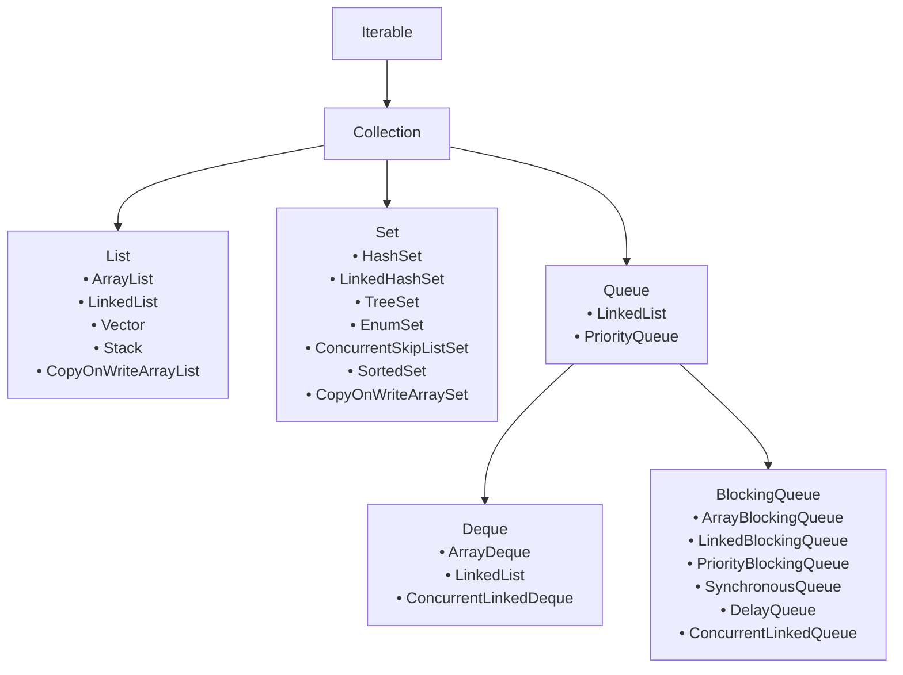

# Java Collections Framework 📚

  
  

---

## 📑 Table of Contents

1. [🔍 What is a Collection?](#-what-is-a-collection)
2. [⏳ Pre-Collections Era](#-pre-collections-era)
3. [⚠️ Problems with Early Classes](#️-problems-with-early-classes)
4. [🚀 Features of the Framework](#-features-of-the-framework)
5. [📋 Key Interfaces](#-key-interfaces)
6. [🔗 Hierarchy Diagram](#-hierarchy-diagram)

---

## 🔍 What is a Collection?
A **Collection** is an object that represents a group of objects, known as its _elements_. It provides a unified way to store, access, and manipulate groups of data.

---

## ⏳ Pre-Collections Era
Prior to Java 1.2, the language relied on disparate classes like **Vector**, **Stack**, **Hashtable**, and **Arrays**. There was:

- ❌ No common interface
- 🔄 Poor interoperability
- 📚 Inconsistent APIs

---

## ⚠️ Problems with Early Classes

1. **Inconsistency** — Each class managed data differently.
2. **Lack of Interoperability** — Classes couldn’t work together seamlessly.
3. **No Common Interface** — Generic algorithms were impossible.

---

## 🚀 Features of the Framework

| ✅ Feature                 | 🔍 Description                                                   |
|----------------------------|------------------------------------------------------------------|
| **Unified Architecture**   | Consistent set of interfaces for all collection types.           |
| **Interoperability**       | Switch implementations without changing your code.               |
| **Reusability**            | Write generic algorithms that work with any collection.          |
| **Efficiency**             | Built‑in algorithms for searching, sorting, and manipulation.    |

---

## 📋 Key Interfaces

- **Collection** — The root interface for all collection types.
- **List** — Ordered, allows duplicates (e.g. ArrayList, LinkedList).
- **Set** — No duplicates (e.g. HashSet, TreeSet).
- **Queue** — Hold elements for processing (e.g. PriorityQueue).
- **Deque** — Double‑ended queue (e.g. ArrayDeque).
- **Map** — Key–value pairs (e.g. HashMap, TreeMap).

---

## 🔗 Hierarchy Diagram

